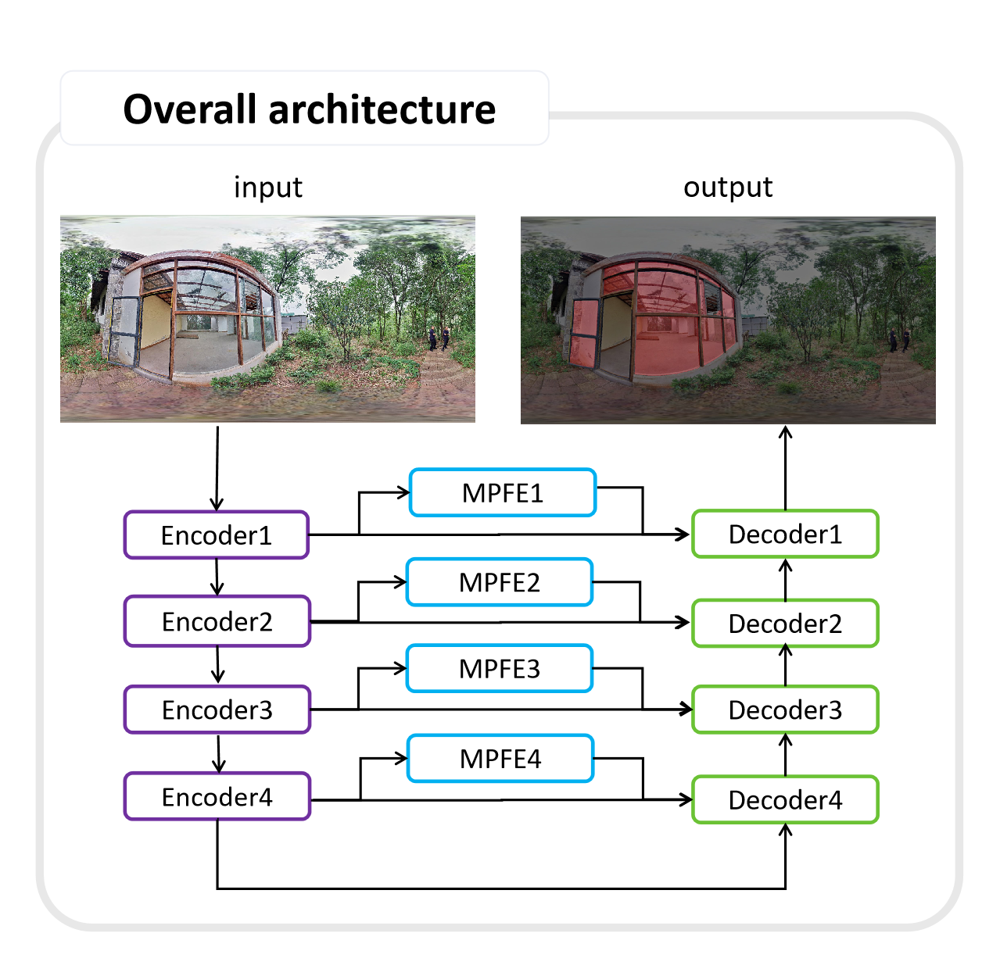

# Glass segmentation with indoor and outdoor panoramic images

Code for this paper Glass segmentation with indoor and outdoor panoramic images]

## Overview

Glass detection is an important task for downstream visual systems that rely on it, such as 3D reconstruction and depth estimation, because the transparency of the glass can mislead them and lead to false results. A panoramic image usually consists of four or more perspective images, which can provide a wider field of view (FOV) and include more objects. Therefore, glass detection based on panoramic images is more robust and practical in complex, realistic environments, providing more reliable support for downstream vision systems. However, as far as we know, there are no glass detection studies based on panoramic images, and most glass detection models are trained on perspective images. As the first work in this direction, we construct a panoramic glass segmentation dataset (PGSD) that distinguishes indoor and outdoor data, and design a panoramic glass segmentation model (PGSNet). Extensive and comprehensive experiments on our dataset show that our model is comparable to state-of-the-art methods.

## Architecture

Our PGSNet uses a standard encoder-decoder framework with jump connections, as shown in Figure 5. PGSNet consists of a encoder, decoder and Multi-path feature extraction(MPFE) module. For encoder, we currently use Segnext with better performance and fewer parameters\cite{mei2020don}. For encoder's output, we adopt two processing methods, one is directly input into the corresponding decoder, and the other is to re-extract the output features using the Multi-path feature extraction(MPFE) module designed by us. The decoder receives the output of the previous decoder in addition to the two inputs corresponding to encoder and Multi-path feature extraction(MPFE).

## Datasets
* [PGSD-vocStructure Baidu Drive](https://pan.baidu.com/s/1wCMbS098kJYyt7GQOuPjTg) code:v3oq

## Prerequisites

*Python 3.8

*PyTorch 2.0.1

*Requirements: mmsegmentation

*Platforms: Ubuntu 22.04, cuda-11.3

## Training

python tools/train.py local_configs/pgsnet/pgsnet.base.512x512.voc.160k.py 

## Testing

python tools/test.py local_configs/pgsnet/pgsnet.base.512x512.voc.160k.py work_dirs/pgsnet.base.512x512.voc.160k/iter_160000.pth
Download the well-trained models [PGSNet](https://pan.baidu.com/s/1l74vn9IuEpzzPwvkut-q_A)  code:cp7n

## Citation

If you use this code and data for your research, please cite our paper.

